## Capitolo undici (11): IL PRANZO

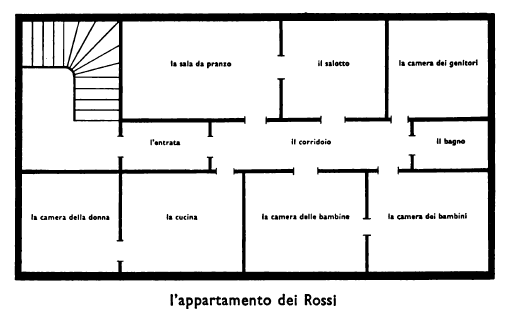

I Rossi hanno un grande appartamento. È un appartamento di otto stanze, una cucina e un corridoio. Le otto stanze dell'appartamento dei Rossi sono: le tre stanze da letto dei genitori e dei bambini, la sala da pranzo, il salotto --- dove va la famiglia dopo i pasti --

<!---
Footnotes
-->

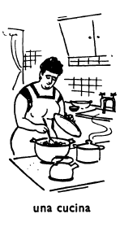

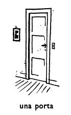

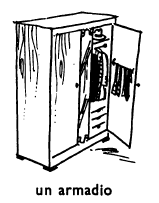

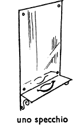

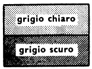

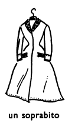

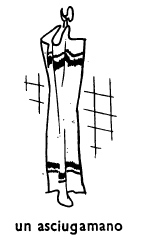

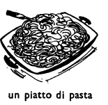

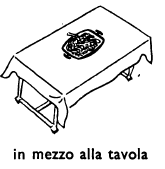

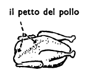

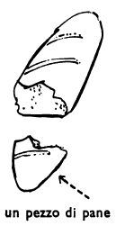

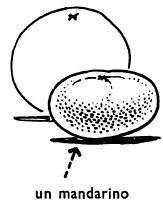

 

<!--stackedit_data:
eyJoaXN0b3J5IjpbLTQ0NzM4NTE5NywtMTY5Mzc4MjQyNiwxMj
YwMzc1MjIzXX0=
-->