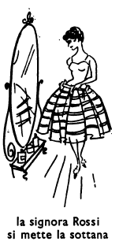

## Capitolo undici (11): IL PRANZO

I Rossi hanno un grande appartamento. È un appartamento di otto stanze, una cucina e un corridoio. Le otto stanze dell'appartamento dei Rossi sono: le tre stanze da letto dei genitori e dei bambini, la sala da pranzo, il salotto --- dove va la famiglia dopo i pasti ---, il bagno, l'entrata, la camera di Amelia. Chi è Amelia? È la donna di servizio dei Rossi. Cosa fa Amelia? Essa prepara i pasti della famiglia e lava i piatti. Però non fa solo quello. Essa fa pure molte altre cose. Per entrare in camera sua, Amelia deve prima entrare in cucina.

La cucina non è un stanza, e neppure il corridoio è una stanza. Si entra nel corridoio dell'entrata e da tutte le altre stanze fuorché da quella della donna di servizio. Se si vuole andare dalla stanza dei genitori in quella dei figli o dalla cucina in sala da pranzo, si deve prima andare nel corridoio, e dal corridoio poi si va nell'altra stanza. Però per passare dalla sala da pranzo in salotto non si deve prima andare nel corridoio, perché fra la sala da pranzo e il salotto c'è una porta. C'è una porta anche fra le stanze dei bambini, e ce n'è una fra la camera della donna e la cucina.

Che cosa c'è nella camera dei genitori? Ci sono molte cose. Prima di tutto ci sono dei mobili, cioè; un letto, un armadio, una piccola tavola, un paio di sedie, eccetera. Ma ci sono molte altre cose nella camera dei genitori. Anche nelle camera dei bambini ci sono dei mobili: armadi, letti, sedie, ecc.

E nella camera di Amelia, che mobili ci sono? Ci sono gli stessi mobili che nella camera dei genitori, ma molto meno belli: un letto, un armadio, un tavolino e una sedia. Nella stanza di Amelia c'è anche uno specchio, come in quella dei genitori, ma lo specchio dei genitori è più grande di quello di Amelia.

Che cosa c'è nell'armadio dei genitori? Ci sono i loro vestiti. È un grandissimo armadio, e a sinistra ci sono i vestiti del signor Rossi, cioè: i suoi calzoni e le sue giacche. Egli ha cinque paia di di calzoni: un paio di calzoni neri, due paia di calzoni bruni e due paia di calzoni grigi --- un paio di calzoni color grigio chiaro e un paio di color grigio scuro. Il signor Rossi ha pure cinque giacche: una nera, due brune --- l'una chiara, l'altra scura, e due grigie --- una grigio chiaro e una grigio scuro.

La signora Rossi ha molto più di cinque vestiti. Una donna ha sempre più vestiti di un uomo. Essa ha cinque vestiti chiari per la primavera e l'estate e quattro vestiti più scuri per l'autunno e l'inverno. Oltre a quei nove vestiti, essa ha tre sottane e cinque bluse. Molte volte essa si mette una sottana e una blusa invece di un vestito.

Oggi, siccome è il suo compleanno, la signora Rossi si mette il suo bel vestito bianco a fiori gialli e rossi. Quel vestito le piace più di tutti gli altri e piace molto anche a suo marito. E siccome il sole d'aprile non èì mo

<!---
Footnotes
-->

 

<!--stackedit_data:
eyJoaXN0b3J5IjpbMTk0MTQ3ODk0OSwxNDY1MTAwNDM0LC05NT
E0MTc3NDcsLTE2OTM3ODI0MjYsMTI2MDM3NTIyM119
-->