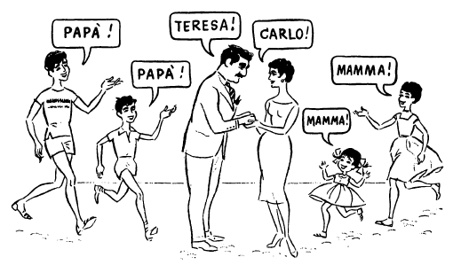
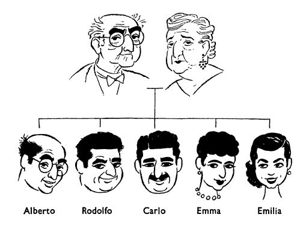

## Capitolo tre (3): NOMI E COGNOMI

I Rossi sono sei: Carlo e Teresa Rossi, Bruno, Pietro, Maria e Pia. «Carlo» e «Teresa» sono due nomi, «Rossi» è un cognome. «Carlo» è il nome del padre, «Teresa» è il nome della madre. Qual è il cognome dei due figli di Carlo e Teresa Rossi? Il cognome dei due bambini è «Rossi». «Rossi» è il cognome dei sei Rossi: del padre, della madre, dei figli, e delle figlie. I genitori e i figli hanno lo stesso cognome. Quali sono i nomi delle due figlie? Sono Pia e Maria.

Il cognome del padre è Rossi. Anche il cognome della madre è Rossi: Teresa Rossi è la moglie di Carlo Rossi. La moglie e il marito hanno lo stesso cognome. Carlo Rossi è il marito di Teresa Rossi. Carlo e Teresa Rossi sono marito e moglie. Carlo Rossi è un uomo sposato. Un uomo sposato è un uomo che ha moglie. Una donna sposata è una donna che ha marito. Il marito di Teresa Rossi è «il signor Rossi». La moglie di Carlo Rossi è «la signora Rossi». Il marito e la moglie sono «i signori Rossi». Qual è il nome del signor Rossi? È Carlo. E qual è il nome della signora Rossi? È Teresa. Carlo e Teresa sono i nomi dei signori Rossi.

Teresa Rossi chiama il signor Rossi «Carlo», e Carlo Rossi chiama la signora Rossi «Teresa». Ma i bambini non chiamano i signori Rossi «Carlo» e «Teresa». I bambini chiamano il signor Rossi «papà» e la signora Rossi «mamma».

Il primo figlio di Carlo Rossi si chiama «Bruno». La prima figlia di Carlo Rossi si chiama «Maria». Come si chiama la seconda figlia di Carlo Rossi? Si chiama Pia. Come si chiama il padre di Bruno? Suo padre si chiama Carlo Rossi. Come si chiama sua madre? Sua madre si chiama Teresa Rossi. Chi è il fratello di Bruno? Suo fratello è Pietro. E chi è la sorella di Maria? Sua sorella è Pia. Chi sono i genitori di Pietro? I suoi genitori sono il signor Rossi e la signora Rossi.

Come si chiamano i fratelli di Maria? I suoi fratelli si chiamano Bruno e Pietro. Chi sono le sorelle di Bruno? Le sue sorelle sono Maria e Pia. Come si chiamano le figlie di Teresa Rossi? Le sue figlie si chiamano Maria e Pia. Chi sono i figli della signora Rossi? I suoi figli sono Bruno e Pietro, le sue figlie sono Maria e Pia. Chi è il marito della signora Rossi? Suo marito è il signor Carlo Rossi.

Il signor Rossi chiama sua moglie «Teresa» e la signora Rossia chiama suo marito «Carlo». I bambini non chiamano il loro padre e la loro madre «Carlo» e «Teresa», ma «papà» e «mamma». Come si chiamano i figli dei signori Rossi? I loro figli si chiamano Bruno e Pietro. E come si chiamano le loro figlie? Le loro figlie si chiamano Maria e Pia.

Qual è il nome del signor Rossi? Il suo nome è Carlo. E qual è il nome della signora Rossi? Il suo nome è Teresa. Il signor Rossi è un italiano: l'Italia è la sua patria. Qual è la patria della signora Rossi? Anche la sua patria è l'Italia. I sei Rossi hanno la stessa patria. L'Italia è la patria degli italiani. La Francia è la patria dei francesi.

Il signor Rossi ha un fratello che si chiama Alberto. Alberto Rossi è lo zio dei bambini Rossi. I fratelli del padre e della madre sono gli zii dei bambini. Il signor Rossi ha anche una sorella che si chiama Emilia. Emilia Rossi è la zia dei bambini. Le sorelle del padre o della madre sono le zie dei bambini. Il signor Rossi ha due fratelli. L'uno si chiama Alberto. L'altro si chiama Rodolfo, ed è anche lui zio dei bambini. Il signor Rossi ha due sorelle. L'una si chiama Emilia Rossi. L'altra si chiama Emma Benelli, ed è anche lei zia dei bambini. Emma Benelli è sposata, Emilia Rossi no. Teresa Rossi ha una sorella. Sono sposati i due fratelli del signor Rossi? Alberto Rossi sì, è sposato, ma Rodolfo no. E le sorelle del signor Rossi, sono sposate? Emilia no, ma Emma sì. Anche la sorella della signora Rossi è sposata. Emilia Rossi non si chiama «signora», ma «signorina» Rossi. Una donna non sposata si chiama signorina. Emilia Rossi è «la signorina Rossi». La moglie di Alberto Rossi non è sorella del papà né della mamma dei bambini, ma anche lei è zia dei bambini. Alberto Rossi è sposato. E Rudolfo ed Emma, sono sposati? Lei sì, ma lui no. Quanti fratelli e quante sorelle hanno Carlo e Teresa Rossi? Lui ha due fratelli e due sorelle, lei ha una sorella. Il marito di Emma Benelli, che è la seconda sorella del padre dei bambini, non è fratello né di Carlo né di Teresa Rossi, ma anche lui è zio dei bambini.

Il padre dei signori Carlo, Rudolfo e Alberto Rossi, il signor Giuseppe Rossi, è nonno dei bambini. Anche il padre della signora Teresa Rossi e di sua sorella è nonno dei bambini. I nonni dei bambini sono i padri dei loro genitori. Le madri dei loro genitori sono le loro nonne. La madre di Carlo Rossi, la signora Giovanna Rossi, è nonna dei bambini, e anche la madre di Teresa Rossi è nonna dei bambini.

### ESERCIZIO A.

(il) suo, (la) sua, i suoi, le sue, il loro, la loro, i loro, le loro

Qual è il nome del signor Rossi? Il --- nome è Carlo. Qual è la patria di Bruno? La --- patria è l'Italia. Chi sono i genitori di Bruno? I --- genitori sono i signori Rossi. Come si chiamano le sorelle di Bruno? Le --- sorelle si chiamano Maria e Pia. Teresa Rossi chiama --- marito «Carlo». E Carlo Rossi chiama --- moglie «Teresa». Chi è la madre di Pietro? --- madre è la signora Rossi. Chi è il padre di Maria? --- padre è il signor Rossi. Come si chiamano le figlie di Teresa Rossi? Le --- figlie si chiamano Maria e Pia. E i figli di Teresa Rossi come si chiamano? I --- figli si chiamano Bruno e Pietro.  Pia chiama i --- genitori «papà» e «mamma». E Teresa Rossi chiama le--- figlie Pia e Maria. I bambini chiamano il --- padre «papà» e la --- madre «mamma». I bambini chiamano i --- genitori «papà» e «mamma». Come si chiamano le figlie dei signori Rossi? Le --- figlie si chiamano Maria e Pia.

### ESERCIZIO B.

Il --- di padre è «Carlo», e il suo --- è «Rossi». Il nome --- madre è «Teresa». Quali sono i nomi --- figli e --- figlie di Teresa Rossi? Sono «Bruno» e «Pietro», «Maria» e «Pia». --- è il nome della seconda figlia? È «Pia». Teresa Rossi è la --- di Carlo Rossi, e Carlo Rossi è il --- di Teresa Rossi. Il --- Rossi è un uomo sposato. Carlo Rossi --- sua moglie «Teresa». I bambini --- la loro madre «---» e il loro padre «---». --- si chiama il padre del signor Rossi? --- chiama Giuseppe Rossi. --- è Emma Benelli? È la --- dei bambini. Suo marito è lo --- dei bambini. Il loro zio Alberto è ---, e sua moglie è zia dei bambini, ma il --- zio Rodolfo non è ---. Come si chiamano i due fratelli di Carlo Rossi? L'--- si chiama Alberto, l'--- si chiama Rodolfo. La moglie di Alberto Rossi non è sorella --- del papà --- della mamma dei bambini, ma anche --- è zia dei bambini. Il padre di Carlo Rossi è --- dei bambini e sua madre è --- dei bambini.

### ESERCIZIO C.

Come si chiama una donna non sposata?

Chi è il nonno di un bambino?

Chi è lo zio di un bambino?

Qual è il nome della madre di Bruno?

Quali sono i nomi dei fratelli di Carlo Rossi?

Quante sorelle ha Teresa Rossi?

Quante zie hanno i bambini, e chi sono le loro zie?

Chi sono gli zii dei bambini?

<!---
Footnotes
-->

[^3.1]: sei = 6

[^3.2]: di + il = del

	di + la = della

[^3.3]: di + i = dei

	di + le = delle

[^3.4]: **il** cognome

	**lo st**esso cognome

[^3.5]: **qual** è...?

	**quali** sono...?

[^3.6]: che ha moglie = che ha una moglie

[^3.7]: che ha marito = che ha un marito

[^3.8]: chiam**a**

	chiam**ano**

[^3.9]: papà = padre

[^3.10]: mamma = madre

[^3.11]: il primo figlio si chiama Bruno = il nome del primo figlio è Bruno

[^3.12]: come si chiama...? = qual è il nome di...?

[^3.13]: **suo** padre : **il** padre **di Bruno**

[^3.14]: **sua** madre : **la** madre **di Bruno**

[^3.15]: **suo** fratello : **il** fratello **di Bruno**

[^3.16]: **sua** sorella : **la** sorella **di Maria**

[^3.17]: **i suoi** genitori : **i** genitori **di Pietro**

[^3.18]: **i suoi** fratelli : **i** fratelli **di Maria**

[^3.19]: **le sue** sorelle : **le** sorelle **di Bruno**

[^3.20]: **le sue** figlie : **le** figlie **di Teresa Rossi**

[^3.21]: **suo** figlio

	**i suoi** figli

[^3.22]: **sua** figlia

	**le sue** figlie

[^3.23]: **il loro** padre : **il** padre **dei bambini**

<!--stackedit_data:
eyJoaXN0b3J5IjpbLTE3NzQyMzEwOTAsNTA1OTQxNjc1LDU5OD
MxMTcwNV19
-->