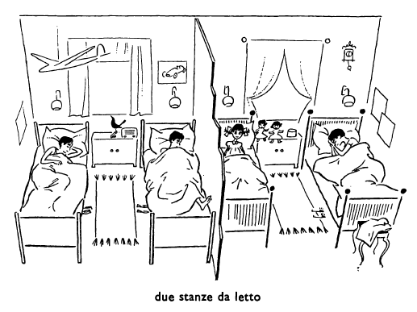
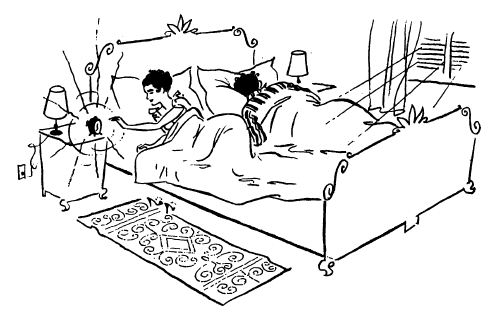

## Capitolo sette (7): LA MATTINA

Che ore sono? Sono le sette di mattina. I bambini sono nei loro letti. I bambini dormono. Però non dormono tutti. Bruno e Pietro dormono ancora, Maria dorme anche lei, ma Pia non dorme più.[^7.1] Pia dorme dalle otto di sera alle sei o alle sei e mezzo di mattina. Quanto dorme Pia? Dorme dieci ore. Pietro, che ha cinque anni più di Pia, non dorme che nove ore:[^7.2] dalle dieci alle sette. Bruno e Maria non dormono che otte ore e mezzo. Vanno a letto alle dieci e mezzo di sera e dormono fino alle sette di mattina. La madre dei bambini, la signora Rossi, non dorme che sette ore: insieme con suo marito va a letto alle undici e dorme solo fino alle sei. Suo marito dorme fino alle sette, come Maria, Bruno e Pietro.

Dove sono i letti dei bambini? Quelli di[^7.3] Bruno e di Pietro sono nella stanza dei due fratelli, quelli di Maria e di Pia sono nella stanza delle due sorelle. Le stanze dove stanno[^7.4] i letti si chiamano stanze da letto. I rossi hanno tre stanze da letto: una per i genitori e due per i bambini. Nella stanza dei genitori non c'è che un letto, però è molto grande. Nelle stanze dei bambini ci sono dei letti motlo più piccoli di quello dei genitori. Ma il letto di bruno è più grande di quello di Pia, perché Bruno è più grande di Pia. Il letto dei genitori è molto grande perché ci[^7.5] dormono e il padre e la madre.[^7.6] I Rossi hanno un letto molto grande per i genitori e quattro letti più piccoli per i bambini.

Nella stanza da letto dei genitori c'è un orologio che alle sei di mattina suona: «DRRRIIIN!». Perché suona l'orologio? Suona perché sono le sei. Alle sei meno dieci la signora Rossi dorme ancora, ma alle sei l'orologio suona e sveglia la signora Rossi. Un orologio che suona la mattina e sveglia le persone che[^7.7] dormono si chiama una «sveglia».

Cosa fa la signora Rossi quando suona la sveglia? Quando suona la sveglia[^7.8] la signora Rossi si alza.[^7.9] E suo marito cosa fa? Si alza anche lui? No, lui non si alza alle sei. Lui non si alza che alle sette.[^7.10] Hanno una sveglia anche i bambini? No, loro non hanno sveglia.[^7.11] Alle sette di mattina, la mamma dei bambini entra nella stanza[^7.12] di Bruno e Pietro e sveglia i due fratelli. Dopo, la mamma entra nella stanza dell bambine e sveglia Maria. Perché non sveglia anche Pia? Perché Pia alle sette non dorme più. Pia alle sette è sveglia. (Una persona che non dorme è sveglia). Maria però[^7.13] non è ancora sveglia alle sette. E i due fratelli? Neanche[^7.14] loro non[^7.15] sono svegli alle sette. Alle sette è sveglia solo la piccola Pia.

Cos'è una sveglia? È un orologio. E cosa fa una sveglia? Suona e sveglia qualli che dormono. A che ora suona la sveglia dei Rossi? Suona alle sei e sveglia la signora Rossi. Cosa fa la signora Rossi quando suona la sveglia? Si alza. E alle sette cosa fa? Entra nella stanza dei bambini e sveglia i due fratelli. E poi cosa fa? Poi[^7.16] entra nella stanza delle bambine e sveglia Maria. Perché non sveglia anche Pia? Perché Pia non dorme. Quando la signora Rossi entra nella stanza delle bambine, Pia è sveglia. Oggi, Pia era già sveglia alle sei, ma altre volte forme fino alle sei e un quarto o fino alle sei e mezzo. Però sta a letto[^7.17] fino alle sette, quando entra la mamma.[^7.18] Dorme sola Pia? No, Pia non forme sola; dorme insieme con sua sorella. Le due bambine dormono nella stessa stanza, ma non nello stesso letto:[^7.19] ci sono due letti nella stanza delle bambine. Neanche Pietro non dorme solo. Lui dorme nella stessa stanza di Bruno,[^7.20] ma non nello stesso letto. Neanche la signora Rossi non dorme sola. Lei dorme nella stessa stanza di suo marito.

Quando si sveglia la signora Rossi? La signora Rossi si sveglia già alle sei, quando suona la sveglia. E poi cosa fa? Poi si alza. Pia si sveglia alle sei o alle sei e mezzo. Ma il signor Rossi non è ancora sveglio alle sei, la signora Rossi lo sveglia alle sette.[^7.21] E a che ora sveglia i due fratelli? La mamma li sveglia anche loro alle sette.[^7.22] E Maria, a che ora la sveglia la mamma?[^7.23] La sveglia alle sette.[^7.24]

Alle sette, la mamma sveglia i fratelli. E poi, cosa fa? Sveglia le due bambine? No, non le[^7.25] sveglia tutte e due.[^7.26] Sveglia solo Maria, perché Pia è già sveglia quando entra la mamma. Dopo i bambini, la signora Rossi sveglia suo marito. E alle sette e cinque tutti e quattro i bambini sono svegl, è sveglio il padre, è sveglia tutta la famiglia. Cosa fa Maria quando è sveglia? Si alze e va nella stanza da bagno. E cosa fa nella stanza da bagno? Nella stanza da bagno Maria si lava.[^7.27] Prima si lava Maria, poi la mamma lava Pia. Dopo le bambine si lavano i due fratelli. La mamma lava Pia, ma non lava Pietro. Pietro è già grande e si lava da solo. Le bambine si lavano dalle sette alle sette e dieci. Alle sette e dieci Maria si veste,[^7.28] poi veste Pia: Pia non si veste da sola. Dopo le bambine si vestono i due fratelli.

Chi lava Pia? È Maria? No, non è Maria che la lava, è la mamma. La mamma lava anche Maria? No, la momma non la lava più. Maria è troppo grande: ha tredici anni. Le mamme lavano i bambini piccoli, non quelli grandi. Non lava neanche Pietro la signora Rossi? No, la momma non lo lava neanche lui. Bruno, Maria e Pietro sono troppo grandi tutti e tre e la mamma non li lava più.[^7.29] Chi è che veste le bambine? È la mamma? No, non è la mamma che le veste. Maria si veste da sola e veste anche Pia. Pia non si veste da sola perché è troppo piccola.

La sera, alle otto, la mamma mette a letto la piccola Pia.[^7.30] A che ora mette a letto gli altri bambini? Non li mette a letto. Perché? Perché gli altri sono già grandi e vanno a letto da soli.[^7.31] Pia non va a letto da sola, ma gli altri sì.[^7.32] Anche Pietro, che ha dieci anni, va a letto da solo. La mamma non lo mette a letto neanche lui.

A che ora si sveglia il signor Rossi? Lo sveglia sua moglie alle sette.[^7.33] E i bambini a che ora si svegliano?[^7.34] La Pia[^7.35] si sveglia alle sei o alle sei e mezzo, e i grandi, li sveglia la mamma alle sette.

Pia non va ancora a scuola perché ha solo cinque anni. Ma quando Pia avrà sette anni, andrà a scuola anche lei.[^7.36] Quando avrà sette anni Pia? Pia avrà sette anni fra due anni. Fra due anni, Bruno avrà diciasette anni. Andrà a scuola a diciasette anni Bruno?[^7.37] No, non andrà più a scuola. E Maria, quanti anni avrà fra due anni? Ne avrà quindici,[^7.38] e andrà ancora a scuola. Pietro ha dieci anni. Quattr'anni fa, ne aveva solo sei.[^7.39] Andava a scuola a sei anni Pietro? No, non ci andava ancora.[^7.40] Quattr'anni fa, quando suo fratello Bruna andava a scuola,[^7.41] Pietro stava in casa,[^7.42] con la mamma e con Pia. Quanti anni aveva Maria quattr'anni fa?[^7.43] Ne aveva nove. Andava già a scuola? Sì, ci andava insieme con Bruno. Bruno andava già a scuola otto anni fa. Otto anni fa, quando Bruno andava a scuola, Maria stava a casa con la mamma e col picollo Pietro.[^7.44] Andrà ancora a scuola fra un anno Bruno? Fra un anno sì, però fra due anni no, non ci andrà più. Dieci anni fa, Pietro non c'era ancora, non c'era neacnhe Pia, e Bruno aveva che cinque anni e stava a casa con la mamma e la piccola Maria di tre anni.

### ESERCIZIO A.

**lav-a, lav-ano, dorm-e, dorm-ono**

Alle sette i bambini non dorm-- più. Alle sei e mezzo il signor Rossi dorm-- ancora. Cosa fa la signora Rossi nella stanza da bagno? Si lav--. Pia no nsi lav-- da sola, ma gli altri bambini si lav-- da soli. La signora Rossi svegli-- suo marito alle sette. I abmbini si lav--, poi si vest--. Pia non si vest-- da sola. È Maria che vest-- Pia. La signora Rossi si svegli-- quando suona la sveglia, ma gli altri non si svegli-- prima delle sette. (Pia però si svegli-- già alle sei e mezzo). Alle sette le bambine si alz-- e vanno nella stanza da bagno. Il signor Rossi si svegli-- dopo i bambini, poi si alz-- e va anche lui nella stanza da bagno.

**aveva, ha, avrà, andava, va, andrà, stava, sta, starà**

Pia non --- a scuola domani. Pian non --- ancora a scuola. Quando Maria --- cinque anni, come Pia, --- a casa anche lei tutti i giorni e non --- a scuola. Oggi, Maria non --- cinque, ma tredici anni, e non --- a casa tutti i giorni. Quando Pia --- sette anni, --- a scuola anche lei e non --- più a casa tutti i giorni.

**lo, li, la, le**

Maria è una bambina grande e la mamma non --- lava più. Chi lava i due fratelli? --- lava la mamma? No. E chi veste le due bambine? --- veste la mamma tutte e due? No, solo Pia, e molte volte --- veste Maria. È la mamma che veste Pietro? No, non --- veste la mamma.

### ESERCIZIO B.

I letti dei bambini sono nelle loro --- da ---. I bambini --- nei loro betti. pia dorme dieci ore, ma Pietro --- forme --- nove ore. I Rossi hanno una stanza da letto --- i genitori e due --- i bambini. Alle sei la sveglia ---: «DRRRIIIN!». Quando suona la sveglia? Suona --- sono le sei. Pia non si sveglia alle sette, Pia è sveglia alle sei e mezzo. Pia non si lava da ---, è la mamma che lava Pia. Ma Maria è --- grande e la mamma non la lava ---.

Alle otto di sera, la mamma --- Pia a letto. Gli altri vanno a letto --- soli. --- due anni, Bruno avrà (17) anni. Due anni ---, Pietro aveva solo otto anni.

### ESERCIZIO C.

Dove dormono i bambini?

Quante stanze da letto hanno i Rossi?

Cosa fa Teresa Rossi quando suona la sveglia?

Cosa fa Teresa Rossi quando entra nella stanza dei fratelli?

Dove si lavano i bambini?

Perché la mamma no nlava anche Maria?

Chi è che veste Pia?

È la mamma che mette a letto i due fratelli?

Quando andrà a scuola Pia?

Quanti anni aveva Bruno sette anni fa?

<!---
Footnotes
-->

[^7.1]: -e

	-ono

	il bambino dorme

	i bambini dorm**ono**

[^7.2]: **non** dorme **che** 9 ore = dorme soltanto 9 ore

[^7.3]: quelli di : i letti di

[^7.4]: stanno : sono

[^7.5]: ci : nel letto

[^7.6]: **e** il padre **e** la madre = il padre **e** la madre

[^7.7]: le persone che = quelli che

[^7.8]: quando suona la sveglia = quando la sveglia suona

[^7.9]: 

[^7.10]: non si alza che alle 7 = si alza alle 7, ma non prima delle 7

[^7.11]: non hanno sveglia = non hanno una sveglia

[^7.12]: 

[^7.13]: Maria però = però Maria

[^7.14]: anche

	neanche

[^7.15]: Bruno dorme.

	**Anche** Pietro dorme.

	Bruno **non** dorme.

	**Neanche** Pietro **non** dorme.

[^7.16]: poi = dopo

[^7.17]: a letto : nel suo letto

[^7.18]: quando entra la mamma = quando la mamma entra

[^7.19]: in + lo = nello

[^7.20]: lui dorme nella stessa stanza di Bruno = lui e Bruno dormono nella stessa stanza

[^7.21]: **lo** sveglia : sveglia **suo marito**

[^7.22]: **li** sveglia : sveglia **i due fratelli**

[^7.23]: **la** sveglia la mamma = la mamma **la** sveglia

[^7.24]: **la** sveglia : sveglia **Maria**

[^7.25]: **le** sveglia : sveglia **le** bambine

[^7.26]: tutt**i** e due (i bambini)

	tutt**e** e due (le bambine)

[^7.27]: 

[^7.28]: 

[^7.29]: **li** lava
	
	**non li** lava
	
	**le** lava

	**non le** lava

	**lo** lava

	**non lo** lava

	**la** lava

	**non la** lava

[^7.30]: 

[^7.31]: da sol**o**

	da sol**i**

	da sol **a**

	da sol**e**

[^7.32]: sì : vanno a letto da soli

[^7.33]: lo sveglia sua moglie = sua moglie lo sveglia

[^7.34]: **si** svegli**a**

	**si** svegli**ano**

[^7.35]: la Pia = Pia

[^7.36]: oggi **ha, va**

	domani **avrà, andrà**

[^7.37]: a 17 anni - quando avrà 17 anni

[^7.38]: **ne** avrà 15 : avrà 15 **anni**

[^7.39]: quattr' = quattro

	quattr'anni fa ↔︎ fra quattr'anni 

	**ne** aveva sei: aveva sei **anni**

[^7.40]: ci : a scuola

[^7.41]: oggi **ha, va**

	ieri **aveva, andava**

[^7.42]: oggi **sta**

	ieri **stava**

[^7.43]: av**eva** ha av**rà**

	and**ava** va and**rà**

	st**ava** sta sta**rà**

[^7.44]: con + il = col
<!--stackedit_data:
eyJoaXN0b3J5IjpbLTEwMTM5NzM2ODYsMTUwMDUxNjU1NV19
-->