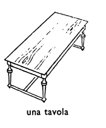
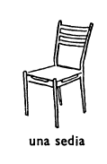
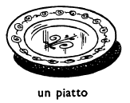
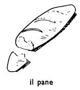
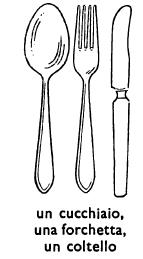

## Capitolo otto (8): I PASTI

All'una e alle otto di sera, tutta la famiglia Rossi è a tavola.[^8.1] Cosa fa la famiglia Rossi quando è a tavola? Mangia. Come molte famiglie italiane, i Rossi mangiano[^8.2] tre volte al giorno. I Rossi fanno tre pasti:[^8.3] il primo pasto (alle sette e mezzo o alle otto di mattina) si chiama «colazione»; il secondo pasto (all'una o all'una e mezzo) si chiama «pranzo»; il terzo pasto (alle otto o alle otto e mezzo di sera) si chiama «cena». Molte famiglie non mangiano che tre volte al giorno, come i Rossi, ma altre famiglie fanno un quarto, piccolo pasto alle cinque del pomeriggio. A che ora fa colazione la famiglia Rossi?[^8.4] La famiglia Rossi fa colazione alle otto di mattina. A che ora pranzano i Rossi?[^8.5] Pranzano all'una. E a che ora cena la famiglia? Cena alle otto di sera.[^8.6] Quando i Rossi pranzano e cenano, ci sono sei persone a tavola: i genitori e i quattro bambini. Non tutti gli italiani fanno colazione alla stessa ora dei Rossi: gli uni fanno colazione prima dei Rossi (alle sette e mezzo o prima ancora), gli altri più tardi dei Rossi (alle otto e mezzo o più tardi ancora).[^8.7] Però, neanche i Rossi non fanno colazione alle otto e mezzo. Non tutte le persone in Italia pranzano alle stessa ora dei Rossi: ci sono delle persone che pranzano prima dei Rossi, ce ne sono[^8.8] che pranzano più tardi. E neanche tutti gli italiana non cenano alla stessa ora dei Rossi: c'è molta gente[^8.9] in Italia che cena prima dei Rossi, ce n'è[^8.10] che cena più tardi di loro. Però, neanche i Rossi non cenano sempre alla stessa ora:[^8.11] molti giorni cenano più tardi, alle otto e mezzo, e a Ostia cenano sempre più tardi che a Roma.

La stanza dove la famiglia pranza e cena si chiama la sala da pranzo. Nella sala da pranzo ci sono una grande tavola e sei sedie---una sedia[^8.12] per il padre, una per la madre e una sedia per ogni bambino: per Bruno, per Pietro, per Maria, per Pia.

Sulla tavola in sala da pranzo, a pranzo e a cena, ci sono sei piatti.[^8.13] Dove sono i sei piatti? Sono davanti ai genitori e davanti a ogni bambini. C'è anche del pane[^8.14] sulla tavola. Gli italiani mangiano molto pane ai pasti. Che cosa[^8.15] c'è ancora sulla tavola? Ci sono molte altre cose: dei coltelli, delle forchette e dei cucchiai: cinque coltelli (la piccola Pia non ha coltello), sei forchette e sei cucchiai.[^8.16] Che altre cose ci sono sulla tavola? Alcune volte c'è anche una bottiglia[^8.17] sulla tavola, a colazione. Che cosa c'è nella bottiglia? C'è del latte. Di che colore è il latte? Il latte è bianco. Quanto latte c'è in una bottiglia di latte? In una bottiglia grande c'è un litro di latte, in una bottiglia più piccola ce n'è mezzo litro[^8.18] o un quarto di litro.

Pia beve un bicchiere[^8.19] di latte a colazione, e molte volte ne beve un bicchiere a pranzo.[^8.20] Poi, ne beve ancora alle quattro o alle cinque del pomeriggio. Quanto latte beve Pia nel pomeriggio? Ne beve[^8.21] uno o due bicchieri. I genitori non bevono latte a colazione. Che coasa bevono a colazione? Bevono[^8.22] una tazza di caffè o due. A colazione, molti italiani mettono[^8.23] del latte nel caffè: un quarto di caffè e tre quarti di latte, oppure metà latte e metà caffè.[^8.24] Il caffè con molto latte si chiama «caffè e latte» o «caffellatte». A colazione, in Italia, la gente beve molto caffellatte.

Il caffè si beve in una tazza.[^8.25] Sotto la tazza c'è un piattino. Che cos'è un piattino?[^8.26] Un piattino è un piccolo piatto. Sopra[^8.27] il piattino c'è un piccolo cucchiaio. Un piccolo cucchiaio si chiama «cucchiaino».[^8.28] Che cos'è il caffè? Il caffè è una bevanda. Anche il latte è una bevanda. A colazione, Pia e Pietro non bevono caffè; invece di caffè bevono latte oppure una tazza di caffè e latte con molto latte e poco caffè. Gli italiani non bevono caffellatte che di mattina. Dopo pranzo e nel pomeriggio si beve del caffè nero. Il caffè si chiama «nero»[^8.29] quando nel caffè non c'è né latte né panna.[^8.30] Il caffè con un poco di latte o di panna si chiama «cappuccino».

Di che colore è il caffè? Ilc affè senza latte[^8.31] è nero. Il cappuccino non è nero, ma bruno. Di che colore è il latte? Il latte è bianco. Anche il pane è bianco in Italia. Con la panna del latte si fa il burro.[^8.32] Il burro è giallo. In Itali si mangia poco burro.[^8.33] Che cosa si fa col latte? Col latte si fa il formaggio e altre cose. In Italia si fa molto formaggio.[^8.34] Anche in altri paesi si fa molto formaggio. In Italia, il formoaggio non si mangia di mattina,[^8.35] ma si mangia a pranzo e a cena.

Che cosa mette il signor Rossi nel suo caffè? Ci mette dello zucchero.[^8.36] Quanto zucchero ci mette? Ce ne mette un cucchiaino.[^8.37] Di che colore è lo zucchero? È bianco. Anche la signora Rossi mette dello zucchero nel caffè, però lei ce ne mette tre cucchiaini. Lo zucchero è dolce. La signora Rossi mette molto zucchero nel suo caffè, e il suo caffè è molto dolce. Il signor Rossi mette nel caffè meno zucchero che sua moglie, e il suo caffè è meno dolce di quello di Teresa Rossi.[^8.38] Il caffè nero senza zucchero no è dolce. In Italia, poca gente[^8.39] beve il caffè nero senza zucchero.

Sopra la tavola, a pranzo e a cena c'è una tovaglia. Di che colore è la tovaglia? La tovaglia è bianca. Sopra la tovaglia, davanti a ogni persona c'è un tovagliolo.[^8.40] Anche i tovaglioli sono bianchi. Davanti a ogni persona ci sono un piatto, un bicchiere, un coltello, una forchetta e molte volte c'è anche un cucchiaio. Quando si mangia,[^8.42] si ha il cucchiaio nella mano destra[^8.41] oppure il coltello nella mano destra e la forchetta nella mano sinistra.[^8.43] Pia però non ha coltello nella mano destra perché è troppo piccola. Lei ha soltanto una forchettina[^8.44] nella mano destra oppure un piccolo cucchiaio.

Dove sono il coltello, la forchetta e il cucchiaio? Sono sopra la tovaglia, a destra e a sinistra del piatto: il coltello e il cucchiaio a destra, la forchetta a sinistra. E molte volte, i tovaglioli sono sopra i piatti. A pranzo e a cena, c'è anche un fiasco[^8.45] sulla tavola. Che coase c'è nel fiasco? Nel fiasco c'è del vino. Quanto vino c'è in un fiasco? In un fiasco piccolo non cìè che un litro di vino, ma in un fiasco grande ce ne sono due.[^8.46]

Il signor Rossi versa del vino nel suo bicchiere, nel bicchiere di sua moglie e nei bicchieri di Bruno e di Maria. Però non versa molto vino nei bicchieri di Bruno e di Maria. Alla domenica,[^8.47] il papà versa del vino anche nel bicchiere di Pietro, però solo mezzo bicchiere. Poi versa dell'acqua[^8.48] nel bicchiere di Pietro, perché Pietro beve soltanto vino con acqua. Pia non beve ancora vino; i bambini piccoli bevono latte o acqua invece di vino. Di che colore è l'acqua? L'acqua non ha colore. E il vino di che colore è? Il vino è bianco o rosso. Quand'è a Roma,[^8.49] il signor Rossi a pranzo e a cena beve del vino rosso, ma ad Ostia beve soltanto vino bianco. Il vino bianco è molte volte, ma non sempre, più dolce del vino rosso.

Cosa c'è sopra la tavola a pranzo e a cena? C'è una tovaglia. E che cosa c'è davanti a ogni persona? Ci sono un tovaglioli, un bicchiere, un piatto e, a destra e a sinistra del piatto, un coltello, un cucchiaio e una forchetta. Che cosa c'è sotto le tazze? Ci sono i piattini. E sopra il piattino? C'è un cucchiaino.

### ESERCIZIO A.

**ne ha uno, ne ha due, ce n'è uno, ce ne sono due**

Quanti anni ha Pietro? *Ne ha dieci.*

Quanti nonni hanno i bambini? *Ne hanno due.*

Quante bambine hanno i Rossi?

Quanti fratelli ha Bruno?

Ha due sorelle Maria? No, ...

Quanti anni ha Gherardo Brunotti?

Quante sorelle ha la signora Rossi?

Quanti abitanti ci sono a Roma? *Ce ne sono due milioni.*

Quante persone ci sono nella famiglia Rossi? *Ce ne sono sei.*

Quanto vino c'è in un fiasco piccolo? *Ce n'è un litro.*

Ci sono molti abitanti in Italia? Sì, ...

Quanto zucchero mette la signora Rossi nel caffè?

C'è molta gente che cena prima dei Rossi? Sì, ...

Quanto latte c'è in una bottiglia grande?

Ci sono molti abitanti a Frascati? No, ...

Mette molto o poco vino nel biecchiere di Pietro il signor Rossi?

### ESERCIZIO B.

Alle otto la famiglia Rossi è a ---. I Rossi --- tre volte al giorno. I tre --- si chiamano: la ---, alle otto di mattina, il ---, all'una, e la ---, alle otto di sera. Quando i Rossi --- o cenano, ci sono sei persone --- tavola. Molta --- in Italia pranza e --- alla stessa ora dei Rossi, ma altre persone pranzano e --- prima dei Rossi o più --- dei Rossi. Ma neanche i Rossi non pranzano e non cenano --- alla stessa ora.

I Rossi pranzano e cenano in --- da ---, dove ci sono una grande tavola e sei ---, due per it gentiori e una per --- bambino. Sulla tavola ci sono sei ---, uno --- a ogni persona. Cosa c'è ancora sulla tavola? Ci sono dei ---, dei --- e delle ---, a destra e a sinistra dei piatti. Pia --- latte a colazione. Di che colore è il latte? È ---. A colazione, i genitori --- una tazza di --- o due. I bambini bevono del --- e ---. Il caffè è una ---. Il caffè --- latte si chiama «---». Il caffè con --- poco di latte si chiama «---». Cosa si fa --- la panna? Si fa il ---. Col latte si fa il ---. Nel caffè si mette dello ---. Lo --- è ---. Sopra la tavola c'è una --- bianca e sei ---. C'è anche un --- con due litri di vino. Il signor Rossi --- del vino nel suo ---. Nel bicchiere di Pietro, versa anche dell'---.

### ESERCIZIO C.

Come si chiamano i tre pasti?

Pranzano sempre alla stessa ora i Rossi?

Cosa c'è sopra la tavola a pranzo e a cena?

Quanto latte c'è in una bottiglia?

Quanto vino c'è in un fiasco grande?

Cosa c'è sotto la tazza? 

E cosa c'è sopra il piattino? 

Cos'è il caffè e latte?

Con che cosa si fa il burro? E il formaggio?

In che mano si ha il coltello quando si mangia?

<!---
Footnotes
-->

[^8.1]: 

[^8.2]: mangi**a**
	mangi**ano**

[^8.3]: fanno tre pasti: mangiano tre volte

[^8.4]: fa colazione = mangia la colazione

[^8.5]: pranzano = mangiano il pranzo

[^8.6]: cena = mangia la cena

[^8.7]: più tardi (di) ↔︎ prima (di)

[^8.8]: **ci** sono

	**ce ne** sono

	ce **ne** sono : ci sono **delle persone**

[^8.9]: molta gente = molte persone

[^8.10]: n' = ne

	ce **n'**è molta : c'è molta **gente**

[^8.11]: sempre : tutte le volte

[^8.12]: 

[^8.13]: 

[^8.14]: 

[^8.15]: che cosa? = cosa?

[^8.16]: 

[^8.17]: 

[^8.18]: ce **n'**è mezzo litro : c'è mezzo litro **di latte**

[^8.19]: 

[^8.20]: **ne** beve un bicchiere : beve un bicchiere **di latte**

[^8.21]: **ne** beve : beve **del latte**

[^8.22]: bev**e** bev**ono**

[^8.23]: mett**e** mett**ono**

[^8.24]: oppure = o

	una metà = ½

[^8.25]: il caffè si beve : la gente beve il caffè

[^8.26]: 

[^8.27]: sopra ↔ sotto

[^8.28]: -ino

	piatto piatt**ino**

	cucchiaio cucchia**ino**

[^8.29]: nero ↔ bianco 

[^8.30]: 

[^8.31]: senza ↔ con

[^8.32]: si fa = la genta fa

[^8.33]: si mangia poco burro = la gente mangia poco burro

[^8.34]: 

[^8.35]: il formaggio si mangia = la gente mangia il formaggio

[^8.36]: di + lo = dello

[^8.37]: **ce ne** mette un cucchiaino = **ci** mette un cucchiaino **di zucchero**

[^8.38]: quello di : il caffè di

[^8.39]: poca gente = poche persone

[^8.40]: 

[^8.41]: 

[^8.42]: si mangia = la gente mangia

[^8.43]: 

[^8.44]: forchetta

	forchett**ina**

[^8.45]: 

[^8.46]: **ce ne** sono due : **ci** sono due **litri di vino**

[^8.47]: alla domenica = la domenica

[^8.48]: **del** vino

	**dello** zucchero

	**della** panna

	**dell'**acqua

[^8.49]: quand' = quando
<!--stackedit_data:
eyJoaXN0b3J5IjpbNjU4ODQ3MDE3LC01NDA0MjYyN119
-->