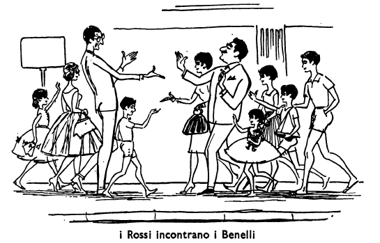
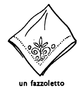
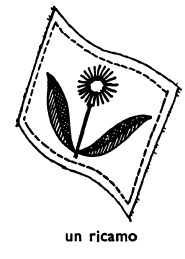
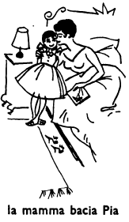
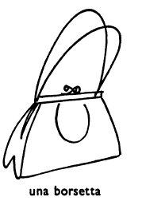
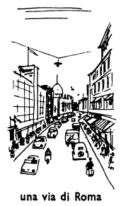

## Capitolo nove (9): IL COMPLEANNO

Oggi è il cinque aprile, e Teresa Rossi ha trentasei anni. Ieri, quattro aprile, Teresa Rossi non aveva ancora trentasei anni, ma oggi, cinque aprile, sì. Oggi è il compleanno della signor Rossi. Il compleanno del signor Rossi è il sei luglio. Il sei luglio Carlo Rossi avrà quarantatré anni.

Oggi non è la mamma che sveglia i bambini, perché quando è il suo compleanno Teresa Rossi non si sveglia alle sei, ma alle sette. Questa mattina è Pia che alle sei e mezzo si alza e chiama sua sorella: «Mariuccia!». Questa volta Maria la sente e domanda: «Che cosa c'è, Pia? Perché non è la mamma che mi sveglia?» Pia risponde: «Non è la mamma che ti sveglia, perché oggi è il compleanno della mamma». Maria: «Dormono ancora? Ma è già tardi: sono le sette meno venti! Fra venti minuti la mamma sarà sveglia».

Cosa fanno allora le due bambine? Vanno nella camera dei due fratelli e chiamano «Bruno! Pietro!». Prima, i due fratelli non rispondono alle loro sorelle, perché dormono e non le sentono; ma poi, quando le bambine chiamano ancora una volta, Bruno si sveglia e domanda: «Che cosa c'è?». Pia: «È il compleanno della mamma e tu dormi ancora!». Bruno: «Ma io non dormo! Io sono sveglio!». Pia: «E Pietro?». Pietro: «Aah...». Pia: «Tu non sei sveglio, Pietro!». «Sì; sono sveglio. Ma perché non è la mamma che ci sveglia oggi?». maria: «Non è lei che vi sveglia perché oggi è il suo compleanno.» Allora i due fratelli si alzano anche loro, perché è molto tardi. Poi Bruno domanda a Maria: «Chi va prima nella stanza da bagno? Ci vai tu o vi vado io?». Maria: «Ci vado io con Pia. Alle sette meno cinque, i quattro bambini sono tutti nella camera delle sorelle, e Bruno dice: «Io ho questo libro per la mamma»; poi domanda: «E tu che cos'hai, Pietro?». Pietro: «Anch'io ho un libro! E voi, bambine? Che cosa avete voi per la mamma?». Maria: «Noi abbiamo questi fiori. E poi abbiamo un fazzoletto e un ricamo». (Maria fa ogni anno un ricamo per la mamma). Pietro: «Chi ha fatto questo ricamo? L'hai fatto tu, Maria?». Maria: «Sì, l'ho fatto io». E Maria mostra il ricamo al suo fratellino. 

### ESERCIZIO A.

### ESERCIZIO B.

### ESERCIZIO C.

<!---
Footnotes
-->

<!--stackedit_data:
eyJoaXN0b3J5IjpbMTc0NjY0MDY2MCwtMjAzODk3OTEzLDk3ND
k2NzkyLDEyNzEyNjc0OTgsMTA0Njc5MzkzNF19
-->